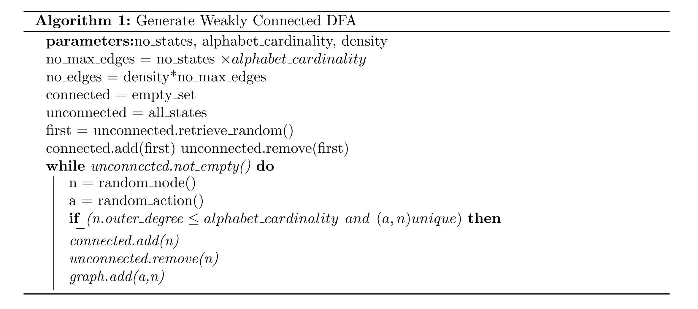
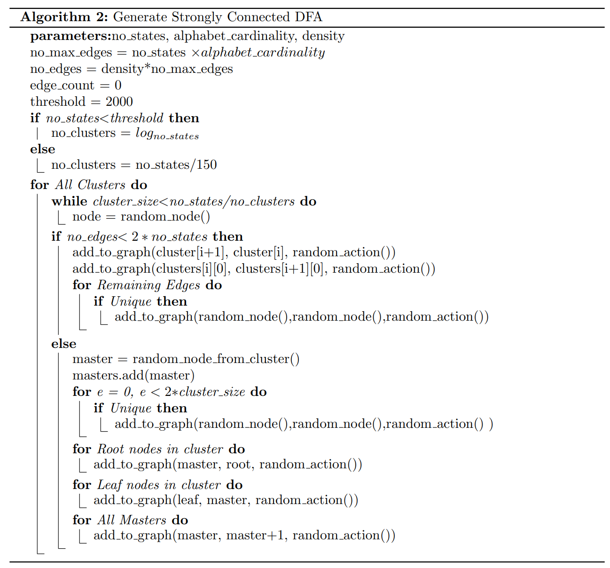

Graph generator yields implementations for 3 different algorithms and helper functions.

### generate_weakly_connected_graph(no_states, no_edges, density, card_alphabet)
Generates weakly connected graph and returns it's *project representation*. The algorithm for this implementation is below.

### generate_strong_connected_graph(no_states, no_edges, density, card_alphabet)
Generates strong connected graph and returns it's *project representation*. The algorithm for this implementation is below.

### generate_strong_connected_graph_2(no_states, no_edges, density, card_alphabet)
Generates strong connected graph and returns it's *project representation*. The algorithm for this implementation is below.

### gv_draw(prag)
Draws visual interpretation of the graph. From tool graphviz.

### gt_draw(prag)
Draws visual interpretation of the graph. From tool graphtools.
